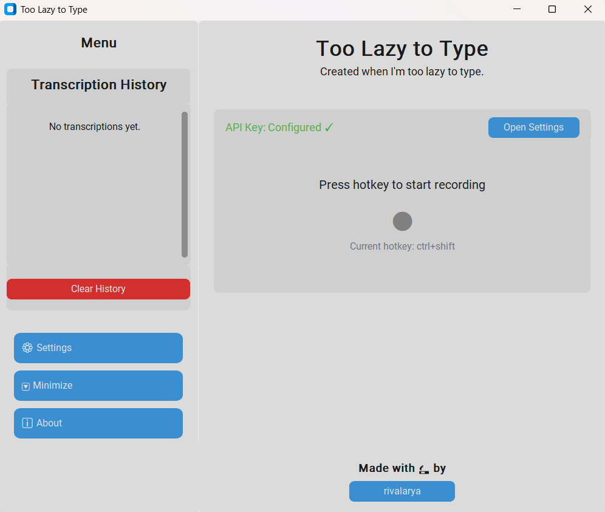

# Too Lazy to Type

A speech-to-text application that lets you dictate text instead of typing, built using Python, CustomTkinter, and OpenAI's Whisper API.

> Sometimes I prefer dictating text rather than typing it. While Windows has a built-in speech-to-text feature, I have to change my system language first before I can speak in that language, which is inconvenient. After searching for alternatives, I came across WhisperTyping. It’s free for now, but according to their FAQ, they plan to charge users in the future. Since I already have an OpenAI account, I decided to create my own program instead—this way, I can keep using it without worrying about switching apps later on.



## Demo
[🎬 Watch the demo](https://drive.google.com/file/d/1WziItzTM0KFKDqfcB9TdJfTsjBgWgkbB/view?usp=sharing)

## Features

- **Voice-to-Text Conversion**: Record your voice and convert it to text using OpenAI's Whisper API
- **Customizable Hotkeys**: Set your own keyboard shortcut for recording
- **Multiple Recording Modes**: Choose between "hold" (record while pressing) or "toggle" (press once to start/stop)
- **History Management**: Access your previous transcriptions with one click

## End User Instructions
If you're not familiar with coding, you can simply download the .exe file [here](https://github.com/rivalarya/too-lazy-to-type/releases/latest). **And make sure you have  [OpenAI API Key](https://platform.openai.com/account/api-keys).**

But if you are comfortable with code, here's how to use the application:

## Requirements

- Python 3.10+
- OpenAI API Key (for Whisper speech-to-text service). Visit [OpenAI API Keys](https://platform.openai.com/account/api-keys) for more information
- Internet connection (for API access)

## Installation

1. Clone this repository:
   ```
   git clone https://github.com/rivalarya/too-lazy-to-type.git
   cd too-lazy-to-type
   ```

2. Install dependencies:
   ```
   pip install -r requirements.txt
   ```

3. Run the application:
   ```
   python main.py
   ```

## Configuration

On first run, you'll need to:

1. Enter your OpenAI API key in the main window
2. Set your preferred hotkey combination
3. Choose your recording mode (hold or toggle)

All settings are automatically saved for future use.

## Project Structure

```
/too-lazy-to-type/
    ├── main.py                      # Main entry point
    ├── config.json                  # Configuration file
    ├── recording.wav                # Temporary recording file
    ├── requirements.txt             # Project dependencies
    ├── README.md                    # This documentation
    ├── .gitignore                   # Git ignore file
    ├── services/                    # Service modules
    │   ├── __init__.py
    │   └── transcription_service.py # Transcription handling with OpenAI
    ├── ui/                          # UI related modules
    │   ├── __init__.py
    │   ├── main_window.py           # Main application window
    │   ├── minimized_main_window.py # A window for when the application is minimized
    │   └── ui_helper.py             # Helper functions for UI
    └── utils/                       # Utility modules
        ├── __init__.py
        ├── audio_recorder.py        # Audio recording functionality
        ├── config_manager.py        # Configuration handling
        ├── history_manager.py       # History management
        ├── hotkey_manager.py        # Keyboard shortcut management
        └── paste_text_manager.py    # Text pasting functionality
```

## How to Use

1. Launch the application
2. Enter your OpenAI API key and save it
3. Press your configured hotkey to start recording
4. Speak clearly into your microphone
5. Release the hotkey (or press again in toggle mode) to stop recording
6. The transcribed text will be automatically inserted at your cursor position

## Advanced Usage

### Customizing Hotkeys

The default hotkey is `ctrl+shift`, but you can change it to any combination:
1. Enter your desired key combination in the "Record Hotkey" field
2. Click "Apply Hotkey"

Examples:
- `ctrl+alt`
- `alt+f`
- `ctrl+shift+r`

### Recording Modes

- **Hold Mode**: Records while you're holding down the hotkey
- **Toggle Mode**: Press once to start recording, press again to stop

### Transcription History

All your transcriptions are saved automatically. To reuse a previous transcription:
1. Click on any entry in the history panel to view the full text
2. Use the "Copy" button to copy it to clipboard

## Troubleshooting

### Text Pasting Issues

If text doesn't paste correctly:
- Try adjusting your system's keyboard repeat rate
- Ensure no other application is capturing your keyboard input
- Check if the application you're pasting into has any input restrictions

### API Key Issues

If you receive an API key error:
1. Verify your OpenAI API key is correct
2. Check that your account has access to the Whisper API
3. Ensure you have sufficient credits in your OpenAI account

### Recording Problems

If recording isn't working:
- Check your microphone settings in your OS
- Ensure your microphone is set as the default input device
- Try restarting the application

## License

This project is licensed under the MIT License - see the LICENSE file for details.

## Acknowledgments

- [OpenAI Whisper API](https://platform.openai.com/docs/guides/speech-to-text) for speech recognition
- [CustomTkinter](https://github.com/TomSchimansky/CustomTkinter) for the modern UI
- [PyAudio](https://people.csail.mit.edu/hubert/pyaudio/) for audio recording functionality
- [keyboard](https://github.com/boppreh/keyboard) for global hotkey support

## Contributing

Contributions are welcome! Please feel free to submit a Pull Request.

1. Fork the repository
2. Create your feature branch (`git checkout -b feature/AmazingFeature`)
3. Commit your changes (`git commit -m 'Add some AmazingFeature'`)
4. Push to the branch (`git push origin feature/AmazingFeature`)
5. Open a Pull Request
